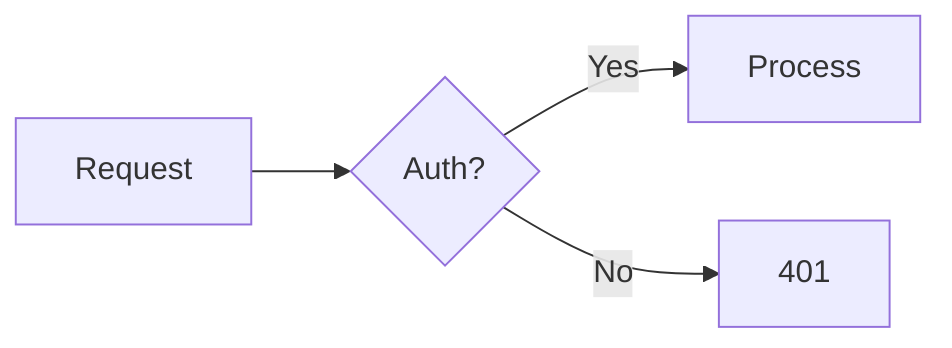

# Compressing & Optimizing LLM Documentation: A Comprehensive Guide

---

## Ⅰ. Foundational Principles

### 1. Semantic Density Effect (SDE) — The Core Metric

**[arXiv:2604.17659]** defines SDE — the ratio of semantically-loaded tokens to total tokens, adjusted for redundancy and concreteness. Dense prompts (SDE > 0.80) outperform diluted counterparts by **+8.4 pp** across 5 frontier models, with **zero token overhead**.

```
SDE(P) = S(P) / W(P) × (1 − R(P)) × C(P)
```
- **S(P)**: semantically loaded tokens (specific nouns, active verbs, numbers, named entities)
- **W(P)**: total token count
- **R(P)**: redundancy fraction
- **C(P)**: concreteness score

**Key implication**: compression isn't about raw brevity — a 60-token prompt can be *denser* than a 15-token one if every token carries non-redundant, concrete meaning.

### 2. Lost in the Middle — Position Dictates Survival

**[Liu et al., arXiv:2307.03172]**: Models use information at **start** and **end** of context reliably; middle information is lost. This dictates ordering:

| Position | What goes there |
|----------|-----------------|
| **Top** | System prompt, durable rules, persona, output constraints |
| **Bottom** (just before model turn) | Current question, key evidence for this turn |
| **Middle** | Long retrieved documents (least reliably used) |

**Practical rule**: Put must-follow rules at the **top** of any `agents.md` or `CLAUDE.md`. Put task-specific context near the **end**.

### 3. Instruction Budget — Diminishing Returns

Research confirms: frontier models reliably follow **~150–200 instructions**. Past that, compliance decays *non-linearly*. A 400-line file is often **less effective** than a 100-line file — rules dilute each other.

> *"Would removing this line cause the model to make mistakes?"* — Anthropic's official test for CLAUDE.md content.

---

## Ⅱ. Lossless Compression (Deterministic, Zero Semantic Change)

Safe first-pass transformations. Apply **always**, before any lossy work.

### Rule Catalog

| Rule | What It Does | Savings |
|------|-------------|---------|
| `strip-frontmatter` | Remove YAML/TOML `---` blocks (when metadata is duplicated) | Low |
| `normalize-unicode` | Smart quotes → ASCII, normalize dashes/ellipses/NBSP | ~1-2% |
| `strip-html-comments` | Remove `<!-- -->` blocks | Variable |
| `strip-badges` | Remove shield.io and decorative badge images | ~1-3% |
| `strip-horizontal-rules` | Remove `---` / `***` decorative lines | ~0.5% |
| `strip-toc` | Remove auto-generated table-of-contents (heading hierarchy suffices) | ~2-5% |
| `collapse-blank-lines` | 3+ blank lines → 2 | ~1-3% |
| `strip-url-tracking-params` | Remove `utm_*`, `fbclid`, etc. | ~0.5% |
| `compress-code-blocks` | Strip shell prompts (`$`/`>`), config comments from fenced blocks | ~3-8% |
| `strip-metadata-lines` | Remove `**Last updated:**`, `**Version:**` lines | ~1-2% |
| `strip-setext-headers` | `====` / `----` → ATX `#` / `##` | ~0.5% |
| `compact-tables` | Remove delimiter rows, compact whitespace in pipe tables | ~15-40% on tables |
| `strip-decorative-images` | Remove standalone decorative images | Variable |
| `strip-trailing-cta` | Remove "star this repo", "follow us" sections | ~1-3% |

### Whitespace & Formatting

```markdown
# Before (lossy for human eyes)
##   Section Title   


This is a paragraph with    extra spaces.   


Another paragraph.
```

```markdown
# After (lossless)
## Section Title

This is a paragraph with extra spaces.

Another paragraph.
```

### Critical: Code Block Protection

**Always** protect fenced code blocks, inline code, and URLs before applying regex-based compression. Restore after. Tools like `mdmin`, `mdcompress`, and `skill-compress` do this.

---

## Ⅲ. Lossy Compression (Semantic Rewriting)

### The Telegraphic Rewriting Heuristic

Transform verbose prose into dense, instruction-like form:

| Pattern | Replacement | Savings |
|---------|-------------|---------|
| *"In order to"* | → `To` | 3→1 tokens |
| *"Due to the fact that"* | → `Because` | 6→1 tokens |
| *"It is important to note that"* | → Delete entirely | 7→0 tokens |
| *"Needless to say"* | → Delete | 3→0 tokens |
| *"As mentioned earlier"* | → Delete | 3→0 tokens |
| *"You might want to consider"* | → Delete (or imperative) | 6→0 tokens |
| *"It's generally a good idea to"* | → Delete | 8→0 tokens |
| *"The system should validate input"* | → `Validate input` | 6→2 tokens |
| *"provides a comprehensive and battle-tested implementation of"* | → `Battle-tested` | 0→1 token retained |

### 7 Compression Principles (from markdown-compressor skill)

1. **Imperative over descriptive**: `"Validate input"` not `"The system should validate input"`
2. **One expression per concept**: deduplicate rules stated in 3 places → keep the most complete
3. **Table over prose**: attribute lists with properties → pipe table
4. **Inline over nested**: `"Use gzip (level 6, min 1KB)"` instead of a paragraph + sub-bullets
5. **Delete implied knowledge**: LLMs know REST, JSON, try/catch. Only state what's **specific to your system**
6. **Merge related sections**: 2 sections sharing >50% content → merge
7. **Preserve structure, compress content**: heading hierarchy intact; prose underneath gets compressed

### What Must NEVER Be Removed

- Specific values, thresholds, constraints (numbers, limits, exact names)
- Behavioral rules: `NEVER`, `ALWAYS` directives
- Tool names, file paths, API endpoints, identifiers
- Decision logic/conditional branches
- Output format specifications
- Edge case handling
- Cross-references
- YAML frontmatter (preserve exactly)

### Compressor-Reviewer Loop (for lossy work)

```
for each section:
  1. Compressor agent → aggressive rewrite (max token reduction)
  2. Reviewer agent    → diff original vs compressed; flag:
     - Lost behavioral rules
     - Removed specific values
     - Missing edge cases
     - Over-generalized instructions
     - Broken cross-references
  3. Human approves/edits/rejects
```

---

## Ⅳ. Structural Optimization

### Progressive Disclosure Architecture

The single highest-impact optimization: **don't put everything in one file**.

```
project/
├── CLAUDE.md              ← root: 30-80 lines, index + critical rules only
├── .claude/
│   ├── skills/
│   │   ├── testing.md     ← loads only when tests are involved
│   │   ├── deployment.md  ← loads only when deploying
│   │   └── code-review.md ← loads only when reviewing
│   └── rules/
│       ├── code-style.md  ← imported via @ reference
│       └── architecture.md
└── docs/
    └── llms.txt           ← discoverable index
```

**Mechanism**: Claude Code pre-loads only skill `name` + `description` into system prompt. Full body loads only on trigger. A 30-skill library costs ~same context as zero skills — until one is needed.

### File Size Budgets (Community Consensus)

| File | Target | Hard Cap |
|------|--------|----------|
| `CLAUDE.md` / `AGENTS.md` (root) | 40–80 lines | 200 lines |
| Per-skill `SKILL.md` | 30–60 lines | 150 lines |
| Sub-directory context file | 50–80 lines | 150 lines |
| Monorepo root (complex) | 100–200 lines | 250 lines |

**The heuristic**: `wc -l CLAUDE.md`. If >200, trim aggressively. Rules past line ~150 start losing adherence; past line ~250, entire sections get ignored.

### llms.txt Standard

`/llms.txt` at site root — a curated index for agents. Structure:

```markdown
# Project Name
> One-sentence blockquote summary of what this project does.

Optional prose context about the project.

## Section Name
- [Page Title](https://example.com/page.md): One-line description of what's there.
- [Another Page](https://example.com/other.md): Another concise summary.

## Optional
- [Secondary Page](https://example.com/extra.md): Can be skipped if context is tight.
```

Key rules:
- H1 + blockquote summary **mandatory**
- Links use absolute URLs
- Keep under 20 KB
- No HTML, no nested lists
- The `Optional` section signals "skip if tight on context"

### Atomic Chunkable Sections

RAG systems and agents chunk by heading boundaries. Structure documents so **each `##` section is a self-contained unit**:

| DO | DON'T |
|----|-------|
| Complete thought per heading | Concept spread across 3 headings |
| Explicit references: "OAuth 2.0 authentication" | "the method mentioned earlier" |
| Critical info in main content flow | Critical info exclusively inside collapsed tabs |
| Parameters + auth + example in one chunk | Parameters in one section, auth 3 headings away |

### Frontmatter vs. Body: Use the Right Container

| Frontmatter (`---` YAML) | Body (Markdown) |
|--------------------------|-----------------|
| Booleans, dates, enums, numbers | Prose, paragraphs, multi-line copy |
| Metadata consumed by tools/scripts | Content that benefits from formatting |
| Machine-written values (hashes, versions) | Anything edited by humans |
| `title`, `kind`, `status`, `tags` | Explanations, code examples, instructions |

---

## Ⅴ. Non-Trivial & Original Techniques

### 1. Telegraph English (TE) — Symbolic Semantic Compression

**[arXiv:2605.04426]** — Rewrites natural language into a symbol-rich dialect using ~40 logical/relational operators:

```
# Natural language (68 tokens):
"The application of our denoising pipeline resulted in a 23% reduction 
in word error rate compared to the baseline, as reported in Chen et al. (2024)."

# TE (14 tokens, ~5x compression):
DENOISING-PIPELINE→WER↓23% VS BASELINE ∵ CHEN-2024
```

**Symbol vocabulary** (core subset):

| Symbol | Meaning | Example |
|--------|---------|---------|
| `=` | Definition/equality | `VELOCITY=DISTANCE/TIME` |
| `→` | Causation/flow | `HEAT→EXPANSION` |
| `⇒` | Logical implication | `RAIN⇒WETNESS` |
| `∴` | Therefore/conclusion | `X>Y ∧ Y>Z ∴ X>Z` |
| `∵` | Because/reason | `MOTOR-FAILURE ∵ OVERLOAD` |
| `↑/↓` | Increase/decrease | `TEMPERATURE↑` |
| `∧/∨/¬` | And/or/not | `A∧B, ¬EVIDENCE` |
| `≈/≠` | Approximate/not equal | `COST≈USD10M` |
| `VS` | Contrast (never causal) | `MODEL-A VS MODEL-B` |

**Tags**: `PAST:`, `NOW:`, `FUTURE:`, `LIKELY:`, `CONF=0.87`, `AGENT:`, `CTX:`, `DEF:`, `Q:/A:`

**Key property**: compression and semantic chunking are the **same operation** — each output line = one atomic fact → simultaneously compressed AND retrieval-ready.

### 2. LLMD — Deterministic Markdown Compiler

**[github.com/Stevenic/llmd]** — Converts Markdown into a line-prefixed compact format:

| Prefix | Meaning | Example |
|--------|---------|---------|
| `@` | Scope (topic) | `@authentication` |
| `:` | Attribute (k=v) | `:rate_limit=1000/m.` |
| `-` | List item | `-Use OAuth2 user-facing apps` |
| `→` | Relation | `→Cache?` |
| `::` | Code block | `::js` … `<<<` … `>>>` |
| *(none)* | Prose | `API supports auth via OAuth2` |

**Compression levels**: c0 (structural normalize) → c1 (compact structure) → c2 (token compaction: stopword removal, phrase normalization, boolean compression)

### 3. Dictionary Deduplication (§-token Compression)

Replace repeated phrases with `§N` reference tokens + prepend a dictionary. Used by both `mdmin` and `compress.new`:

```markdown
# Dictionary
§1: authentication middleware
§2: rate limiting strategy

# Body
Apply §1 before §2. The §1 validates tokens.
§2 uses sliding window, configurable per-endpoint.
```

Savings increase with document length and repetition frequency. The **LZ77 meta-token principle** formalizes when this is worthwhile:

```
N × K > 1 + N + K
```
Where N = subsequence length (tokens), K = non-overlapping occurrences. Replace when: N≥4 & K≥2, or N=3 & K≥3, or N=2 & K≥4.

### 4. Structured Data Over Prose

When documenting parameters, configs, or API specs — **YAML/JSON blocks are denser than prose**:

```markdown
# Before: prose (high token count)
The authentication endpoint accepts a POST request with a JSON body.
The body must include a "username" field of type string, a "password" 
field of type string, and optionally a "remember_me" field of type boolean.
The endpoint returns a JWT token in the response.

# After: structured (lower token count, same information)
```yaml
POST /auth
  body:
    username: string   # required
    password: string   # required
    remember_me: bool  # optional, default=false
  returns: { token: JWT }
```
```

### 5. Pseudocode for Logic Flows

Replace narrative descriptions of conditional logic with pseudocode:

```markdown
# Before
When the user attempts to access a resource, the system should first check
if they have a valid session. If they do, it should then check whether the
session has the required permissions for that resource. If the session is
valid but lacks permissions, return a 403 error. If the session is invalid,
redirect to the login page.

# After
ACCESS(resource):
  IF ¬valid_session(): REDIRECT /login
  IF ¬has_permission(session, resource): 403
  PROCEED
```

### 6. Mermaid/Text Diagrams Instead of Images

Images cost tokens (base64) or require external fetch. Text-based diagrams are native:



Mermaid is readable by LLMs directly — they can reason about the diagram structure.

### 7. Formula + LaTeX for Mathematical/Statistical Content

```markdown
# Before (prose)
The compression ratio is calculated as one minus the compressed size 
divided by the original size, expressed as a percentage.

# After
$CR\% = (1 - \frac{S_{compressed}}{S_{original}}) \times 100$
```

### 8. Multi-Language Code Blocks (Show Pattern, Not Repetition)

```markdown
# Before: 3 separate blocks
## Python
```python
client = SDK(api_key=os.environ["KEY"])
```

## JavaScript
```js
const client = new SDK({ apiKey: process.env.KEY })
```

## Rust
```rust
let client = SDK::new(std::env::var("KEY")?);
```

# After: single condensed block
```python,js,rust
# Python:  SDK(api_key=os.environ["KEY"])
# JS:      new SDK({ apiKey: process.env.KEY })
# Rust:    SDK::new(std::env::var("KEY")?)
```
```
Or use a table:
| Language | Instantiation |
|----------|--------------|
| Python | `SDK(api_key=os.environ["KEY"])` |
| JS | `new SDK({ apiKey: process.env.KEY })` |
| Rust | `SDK::new(std::env::var("KEY")?)` |

### 9. Context Codec Language (CCL)

**[arXiv:2605.17304]** — An ASCII-first compact rendering of canonical JSON atoms for dialogue state compression. Uses typed, source-grounded semantic atoms with identity, equivalence, conflict, confidence, risk, and evidence spans.

### 10. Image Links → Reference, Don't Embed

```markdown
# Bad: inline base64 image (thousands of tokens wasted)


# Good: descriptive alt text + URL reference


# Better: replace with Mermaid when possible
# Best: if the image isn't critical for LLM understanding, delete it
```

---

## Ⅵ. AGENTS.md / CLAUDE.md Specific Rules

### What Belongs (The Strict Test)

> *"Would removing this line cause the agent to make mistakes?"* — If no → delete.

| ✅ Include | ❌ Exclude |
|------------|------------|
| Commands the agent can't guess | Anything inferable from reading code |
| Code style rules differing from defaults | Standard conventions the model already knows |
| Testing instructions + preferred runners | Detailed API docs (link instead) |
| Repo etiquette (branch naming, PRs) | Info that changes frequently |
| Architectural decisions specific to project | Long explanations or tutorials |
| Dev environment quirks (env vars) | File-by-file codebase descriptions |
| Non-obvious gotchas/pitfalls | "Write clean code" — self-evident |

### The Toolchain-First Principle

> *"If a constraint can be enforced deterministically by a tool already in the repo — linter, formatter, type checker, hook, or CI gate — it **must not** be restated in agents.md."* — [ASDLC.io AGENTS.md Spec](https://asdlc.io/practices/agents-md-spec/)

The tool **is** the constraint. Restating creates maintenance debt and dilutes signal.

### The Pink Elephant Problem (Context Anchoring)

Telling an LLM what **not** to do ensures the concept is front-and-center in its attention mechanism. `"Do not use tRPC"` → the token `tRPC` is now highly active.

**Fix**: State positive alternatives. Instead of `"Never use var"` → `"Use const/let"`. Instead of `"Don't use tRPC"` → `"Use REST with fetch"`.

### Optimal Section Order

1. **CRITICAL RULES** — red lines first (`"Never push to main"`, `"Never rm -rf"`)
2. **PROJECT CONTEXT** — stack, monorepo layout, key architecture
3. **BUILD & TEST COMMANDS** — concrete, copy-pasteable
4. **CODE STYLE** — with examples (show good + bad)
5. **FILE ORGANIZATION** — what lives where
6. **VERIFICATION** — how to confirm no regression
7. **COMMON PITFALLS** — accumulated, in event order

Commands go **early** (agents reference them frequently). Boundaries go **early**. Explanations go later or in separate files.

---

## Ⅶ. Tools Landscape

| Tool | Approach | Savings | Cost |
|------|----------|---------|------|
| **[mdmin](https://mdmin.dev)** | 150+ verbose patterns + table compression + dedup + whitespace | 13–35% (rule), up to 58% (LLM-rewrite) | Free / $8/mo Pro |
| **[mdcompress](https://github.com/dhruv1794/mdcompress)** | 35 deterministic rules, 3 tiers (safe/aggressive/llm) | Tier-dependent | Free, OSS |
| **[compress.new](https://compress.new)** | URL→clean MD + dedup compression | Up to 90% (with main_only + compress) | Free |
| **[LLMD](https://github.com/Stevenic/llmd)** | Markdown→line-prefixed compact format, 3 compression levels | Variable | Free, MIT |
| **[skill-compress](https://github.com/Kantic-Analytics/skill-compress)** | Safe deterministic cleanup + LLM adjudication | Variable | Free, OSS |
| **[llm-docs-builder](https://github.com/mensfeld/llm-docs-builder)** | Generates llms.txt with metadata, priority, token counts | 67–95% | Free, OSS |

---

## Ⅷ. The Compression Pipeline — Putting It All Together

### Stage 1: Structural Audit

```
1. wc -l AGENTS.md → flag if >200 lines
2. Parse heading hierarchy → identify oversized sections (>500 tokens)
3. Identify cross-section redundancy
4. Identify content that belongs in tools, not docs
```

### Stage 2: Lossless Pass

```
strip-frontmatter (if metadata duplicated)
  → normalize-unicode
  → strip-html-comments
  → strip-badges + strip-decorative-images
  → strip-horizontal-rules
  → strip-toc
  → collapse-blank-lines
  → strip-url-tracking-params
  → compress-code-blocks
  → strip-metadata-lines
  → compact-tables
  → strip-trailing-cta
```

### Stage 3: Lossy Pass (Compressor-Reviewer)

```
for each ## section:
  1. Apply telegraphic patterns:
     - verbose phrases → short
     - imperative over descriptive
     - delete implied knowledge
     - merge redundant statements
  2. Table-form where possible
  3. YAML/JSON for structured data
  4. Pseudocode for logic flows
  5. §-token dedup for repeated phrases
  6. Reviewer check → human approval
```

### Stage 4: Progressive Disclosure Split

```
If root file >200 lines after compression:
  → Extract task-specific sections into skills/
  → Extract code conventions into .claude/rules/
  → Keep only index + critical rules in root
  → Reference external files by name
```

### Stage 5: Measure

```python
def estimate_tokens(text: str) -> int:
    """Rough heuristic: words × 1.3 for English markdown."""
    return int(len(text.split()) * 1.3)

def report(original: str, compressed: str) -> dict:
    orig_tok = estimate_tokens(original)
    comp_tok = estimate_tokens(compressed)
    return {
        "original_tokens": orig_tok,
        "compressed_tokens": comp_tok,
        "reduction_pct": round((1 - comp_tok/orig_tok) * 100, 1),
        "mode": "lossy"  # or "lossless"
    }
```

---

## Ⅸ. Key Resources

| Resource | URL | Value |
|----------|-----|-------|
| **SDE Paper** | [arxiv.org/abs/2604.17659](https://arxiv.org/abs/2604.17659) | Formal framework for information density |
| **Telegraph English** | [arxiv.org/abs/2605.04426](https://arxiv.org/abs/2605.04426) | Symbolic prompt compression protocol |
| **Lost in the Middle** | [arxiv.org/abs/2307.03172](https://arxiv.org/abs/2307.03172) | Position-attention U-curve research |
| **llms.txt Spec** | [llmstxt.org](https://llmstxt.org) | The standard for LLM-facing site indexes |
| **Markdown Compressor Skill** | [GitHub: oborchers/fractional-cto](https://github.com/oborchers/fractional-cto/blob/main/markdown-compressor/skills/markdown-compression/SKILL.md) | Best-in-class skill reference for compression workflow |
| **AGENTS.md Spec (ASDLC)** | [asdlc.io/practices/agents-md-spec](https://asdlc.io/practices/agents-md-spec/) | Research-backed spec, toolchain-first principle |
| **LLMD** | [github.com/Stevenic/llmd](https://github.com/Stevenic/llmd) | Deterministic MD→compact compiler |
| **Cloudflare AI Consumability** | [developers.cloudflare.com/style-guide](https://developers.cloudflare.com/style-guide/how-we-docs/ai-consumability/) | Production battle-tested: MD vs HTML = 7.22× token reduction |
| **AGENTS.md Analysis (2500+ repos)** | [github.blog](https://github.blog/ai-and-ml/github-copilot/how-to-write-a-great-agents-md-lessons-from-over-2500-repositories/) | Data-driven: what works in the wild |
| **mdmin** | [mdmin.dev](https://mdmin.dev) | Free compression tool; live demo |
| **Context Compression Language (CCL)** | [arxiv.org/abs/2605.17304](https://arxiv.org/abs/2605.17304) | Verifiable context compression framework |

---

## Ⅹ. Opinionated Summary

The most under-exploited compression vector is **not** word shortening — it's **format shifting**: prose → table, prose → YAML, prose → pseudocode, prose → symbolic notation. LLMs parse structured formats more reliably than verbose prose, and structured formats are inherently denser.

The second-most under-exploited is **progressive disclosure**: the root file as an index, not a dump. The `llms.txt` standard + the skills architecture in Claude Code point toward the same pattern — separate discovery from content, and load only what's needed.

The third: **treat every line as a cost center**. The test is brutal and simple: *"Would removing this cause the model to make mistakes?"* Most documentation fails this test.